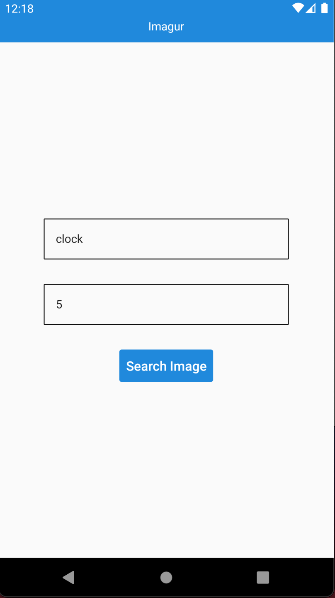

<h1>Imagur</h1>
<br/>





<br />
<br />
<br />
```bash
npm install
```
or
```bash
yarn
```

ios
```bash
cd ios/ && pod install && cd ..
```

start

```bash
npx react-native run-ios
npx react-native run-android
```